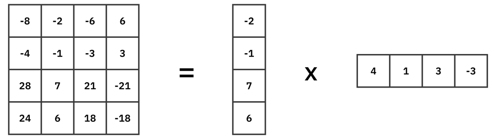

# ✨ **LoRA (Low-Rank Adaptation)**
- LoRA fine-tunes large models by **freezing the base model weights** and injecting **low-rank trainable weight** matrices.
- **Uses low-rank updates instead of updating full weights**

---

# ⚙️ **How It Works**

## ✅ **Step-1: Track all weight changes**
- LoRA freezes **$W_0$** and **tracks the changes in the base model weights $W_0$** then **preserves** those changes in **ΔW**.

$$
\Delta W \text{ =  low-rank matrix}
$$

---

## ✅ **Step-2: Matrix decomposition part (Low-Rank Trick 📐)**
A high-rank matrix can be decomposed into two low-rank matrices, a 4 x 4 matrix can be decomposed into a 4 x 1 and a 1 x 4 matrix.

$$
\Delta W = B A
$$

Where:

- $A \in \mathbb{R}^{d \times r}$ &nbsp;&nbsp; (d = 4 ; r = 1) &nbsp;&nbsp; -> Low rank matrix 1
- $B \in \mathbb{R}^{r \times k}$ &nbsp;&nbsp; (r = 1 ; k = 4) &nbsp;&nbsp; -> Low rank matrix 2
- **$r \ll \min(d, k)$** (tiny rank)

This reduces parameters from:

$$
d \times k \quad \text{to} \quad r(d + k)
$$

r(d + k) is **much smaller** ✅

---

## ✅ **Step-3: Add Base Model Weights + LoRA Weights**
During the forward pass the effective weight becomes:

$$
W_{\text{eff}} = W_0 + B A
$$

- **$W_0$** stays frozen  
- Only **A** and **B** are trained low ranked matrices 

---

